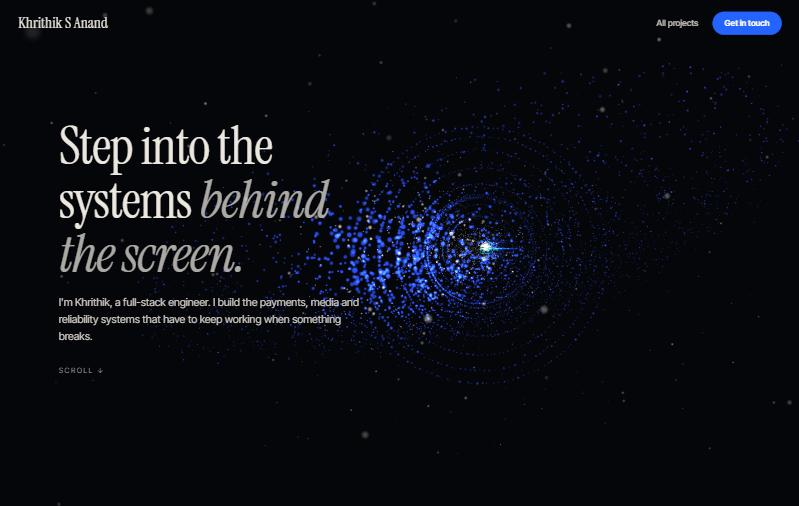
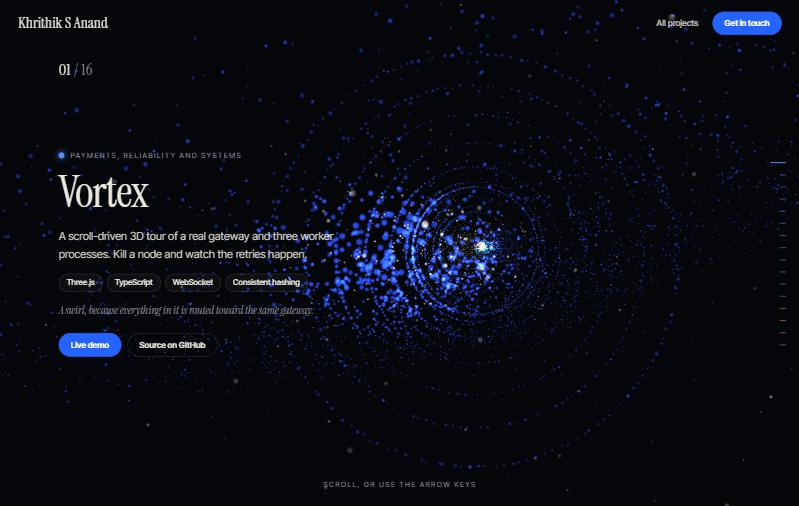
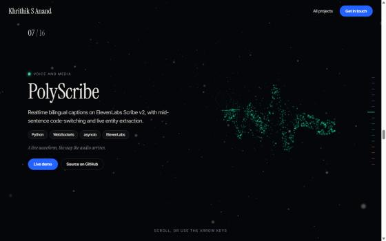
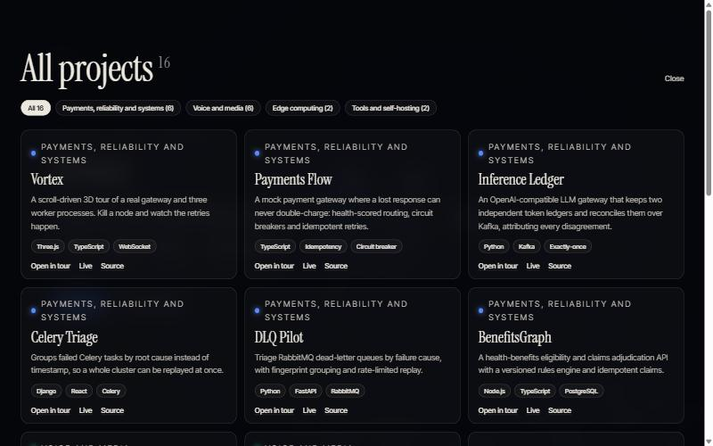
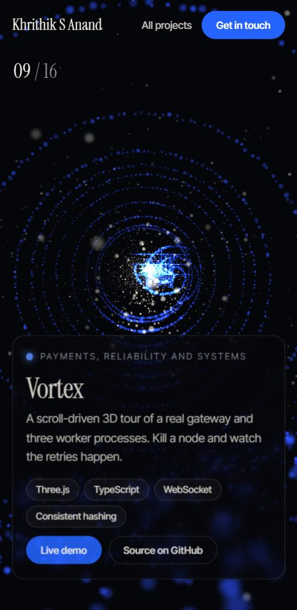

# Portfolio v2

[](https://portfolio-rho-blue-18.vercel.app)

> This replaced the earlier Next.js portfolio. The old version is kept on the [`legacy-nextjs`](https://github.com/kk10-x/portfolio/tree/legacy-nextjs) branch.

A scroll-driven WebGL portfolio. You click to enter, then fly through a particle universe: eight highlights, each its own constellation shaped to say something about what the project does, and all 16 of my projects one click away.



| Vortex, the first stop | PolyScribe, drawn as a live waveform |
| --- | --- |
|  |  |

| All projects, filterable | Phone layout |
| --- | --- |
|  |  |

The visual language follows the Razorpay Vulcan launch page (a dark particle scene driven by scroll, a "click to enter" gate, one statement per screen, a serif display face with a blue pill call to action). The content, the shapes, the interaction and the code are mine.

## Tech stack

- **Frontend:** Vite and TypeScript, [Three.js](https://threejs.org) with a custom point-sprite shader. No UI framework and no scroll library.
- **Fonts:** Instrument Serif and Inter Tight (Google Fonts).
- **Tests:** `node:test` through `tsx`.
- **CI:** GitHub Actions: typecheck, tests, production build.

## How it works

- **One scene, seven stops.** A single canvas stays pinned behind the page. The page is seven sections (hero, intro, numbers, experience, projects, skills, contact). Scroll position picks the section and how far through it you are, and the camera flies along a path built from one pose per section.
- **Stepped scrolling.** The page has a fixed list of stops (the hero, each statement, the numbers, each job, each of the 16 projects, the toolkit, the contact screen). One wheel spin, trackpad flick, swipe or key press moves exactly one stop, however hard it is. A fast spin or a coasting trackpad is one gesture: the first event steps, the rest of that stream is ignored until there is a pause ([`src/snap.ts`](src/snap.ts), with tests). Click anywhere on the opening screen to enter. A refresh always starts back at the top behind the opening screen, rather than restoring the old scroll position.
- **The projects tour.** Eight constellations (the first eight entries of `projects`, see `TOUR_SIZE`) sit along that path, 20 units apart. It was sixteen at first, but nobody scrolls that far. Between stops the camera dwells on each constellation long enough to read its card, then travels to the next. The active constellation glows and the rest dim.
- **The overview.** After the 16th project the camera flies into a tunnel of rings. Five projects at a time drift toward the camera along its walls, each with a label, fading out as new ones arrive from the far end, until all 16 have had a turn (sixteen at once was too cluttered). Hovering one pauses the whole set, so it is easy to click; it glows and swells; click the shape or its label to open that project in a new tab (the live demo if there is one, otherwise the source on GitHub). Labels are real links, so they work with the keyboard and with a tap on a phone. Hit testing projects each shape to the screen and picks the closest one ([`src/pick.ts`](src/pick.ts), with tests).
- **Shapes that mean something.** Each project has its own generator in [`src/shapes.ts`](src/shapes.ts). Payments Flow is three lanes streaming through one gate. Celery Triage is scattered failures gathered into a few clusters. Polyscribe is a live waveform. Dub QC is a timeline with ad breaks as tall ticks. Edge Personalization Router is a tree. Four motions (still, flow, wave, swirl) run in the vertex shader, so a thousand-point shape costs nothing on the CPU.
- **Everything still fits.** The scroll tour is the short highlights reel. The overview rotates through all 16, and the **All projects** button opens an index of all 16 with category filters. Tiles for the eight tour projects jump to their place in the tour. Every project also has a deep link such as `#payments-flow`.
- **Hidden on purpose.** The tour lists the 16 public, recent repos. This site, forks, private repos, college lab work and scratch repos are excluded. [`tests/data.test.ts`](tests/data.test.ts) fails if a hidden repo sneaks in.
- **Still works without the fancy bits.** With no WebGL, the page drops the scene and shows every project as a plain card grid. With `prefers-reduced-motion`, scrolling jumps instead of gliding, the camera parallax and slow spins are off, and the camera cuts instead of flying. With no WebGL, scrolling is the browser's own. The gate and the index are keyboard accessible (Enter or Space to enter, Escape to close the index, arrow keys, Page Up and Down, Space or `j` and `k` to step, Home and End to jump to the ends).

## Setup

Requires Node 20 or newer.

```bash
npm install
npm run dev        # http://localhost:5173
```

```bash
npm test           # data integrity and shape generators
npm run lint       # tsc --noEmit
npm run build      # static site in dist/ (relative paths, works from any URL or sub-path)
npm run check:projects   # compare the tour with what is actually public on GitHub
```

### Adding a project

Add an entry to `projects` in [`src/data/projects.ts`](src/data/projects.ts) with a title, one-line blurb, tags, a category, a shape and a caption. The section height, counter, ticks, index and filters are all derived from the array. Pick a shape no other project uses (the tests require each shape to be unique), or write a new generator in `shapes.ts`. To choose who is in the scroll tour, reorder the array: the first `TOUR_SIZE` entries are the tour, the rest appear in the overview and the index. `npm run check:projects` lists public repos that are not in the list at all yet.

## Limitations

- The project list is curated by hand, not pulled live from GitHub. That keeps the copy tight, but it means `check:projects` has to be run to notice new repos.
- Particle counts are tuned for a mid-range laptop. About 26,000 points exist in the scene, and it has not been profiled on low-end phones.
- Live demo links point at a home server (reachable over Tailscale Funnel) and a few GitHub Pages sites. If the home server is offline those links won't load.
- Fonts load from Google Fonts. Offline, it falls back to system serif and sans-serif.

## Why I built this

My previous portfolio listed only 8 of my projects and looked like every other portfolio. I wanted one where the work is the interface, and where all of it fits.
